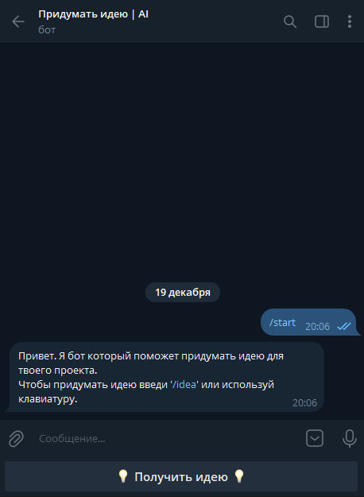
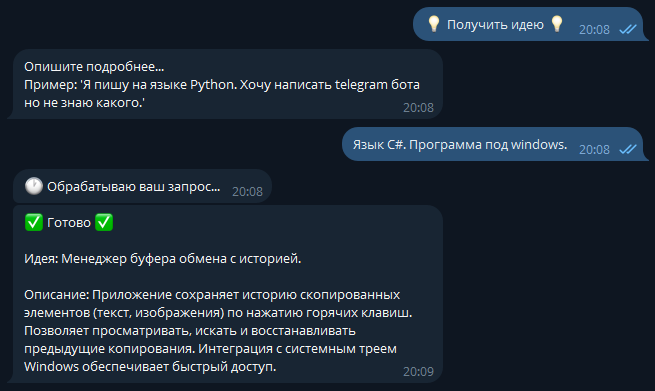

Telegram-idea-bot - бот телеграмм с помощю которого можно генерировать идеи для создания проектов.

Для использования бота понадобится:
1. API ключ бота в telegram
2. API ключ LLM (который можно получить на OpenRouter)

Пример использования бота:

*1. Старт бота*  

*2. Использования бота*  

